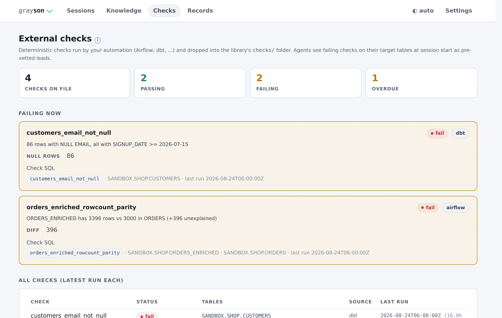

<div align="center">

<picture>
  <source media="(prefers-color-scheme: dark)" srcset="docs/img/wordmark_dark.svg">
  
</picture>

**The sidekick your warehouse deserves.**

Guarded SQL rails for agentic, open-ended data investigation — Snowflake-first.

[](pyproject.toml)
[](LICENSE)
[](#what-the-rails-enforce)

</div>

---

Your agent — in Cursor, Claude Code, Codex, or any harness — is the detective;
it supplies the analysis. grayson is the sidekick: it carries the kit and keeps
the case file — guarded read-only warehouse access, sessions
that cannot claim work without evidence, cached results with freshness tracking,
live analysis charts, deterministic-check ingestion, a git-shared team knowledge
library, and a human-in-the-loop web console.

grayson itself never calls an LLM. Every guarantee below is enforced by code, not by
prompting.

<picture>
  <source media="(prefers-color-scheme: dark)" srcset="docs/img/session_dark.png">
  
</picture>

*A bug-hunter session, live: the agent's charts (each traceable to an executed
query id), checkpoint progress, and the evidence trail. The page refreshes itself
while agents work.*

## The loop

1. **Start** — a session is opened for a workflow (`bug-hunter`, `table-health`, …)
   over target tables. grayson snapshots metadata, loads the relevant knowledge,
   runs the QA-view coverage check, and reports any failing external checks on
   those tables as pre-vetted leads.
2. **Analyze** — the agent runs arbitrary read queries inside the guard. Results
   are cached as artifacts (`q_0001`, …); charts make the reasoning visible as it
   happens. Required checkpoints close only by citing executed queries.
3. **Ask** — when a judgment call needs a human (labeling samples, confirming
   semantics), the agent files an intervention and waits; you answer in the console.
4. **Findings → fixes → verification** — findings validate against the workflow's
   schema and must cite evidence. You accept findings and approve proposed fixes;
   the agent applies approved file diffs and proves the fix with a deterministic
   before/after comparison of re-run queries.
5. **Compound** — durable learnings are written to the knowledge library, so the
   next session (yours or a teammate's) starts briefed.

## What the rails enforce

| Rail | Mechanism |
|---|---|
| Read-only warehouse access | Every statement is parsed (sqlglot, Snowflake dialect) and default-denied: only `SELECT`/`SHOW`/`DESCRIBE`/`EXPLAIN` survive. Side-effecting functions, scope escapes, and multi-statements are rejected. Agents never hold write rights — fixes are proposals you apply. |
| Evidence or it didn't happen | Checkpoints, findings, and fix verifications only close by citing query ids that actually executed *and touched the tables under investigation*. |
| Cost control | Guard profiles bundle three independent controls — auto-`LIMIT`, per-statement timeout, per-session query budget — selected per session, editable per workspace. |
| Scope | Out-of-scope reads warn by default; `strict` mode blocks them. |
| Human approval at the boundaries | DDL execution, fix application, budget raises, and gate overrides are user actions. Agents cannot force past an evidence gate or change the guard configuration (the MCP settings surface is read-only). |
| Audit | Every statement — accepted or rejected — is recorded with hash, worker, verdict, and stats. |

Details and threat model: [docs/SPEC.md](docs/SPEC.md) ·
[docs/SECURITY.md](docs/SECURITY.md) (adversarial guard test suite and review
history).

## Install

Requires [uv](https://docs.astral.sh/uv/) (installs Python 3.12+ automatically) and,
for real warehouses only, the
[Snowflake CLI](https://docs.snowflake.com/en/developer-guide/snowflake-cli)
(`snow`) with a named connection — grayson delegates all auth to `snow` and never
handles credentials. The sandbox below needs no Snowflake at all.

```bash
uv tool install git+https://github.com/Kcarreras/grayson   # or: git clone && uv sync
cd your-data-repo
grayson init .                    # scaffold a workspace (grayson.toml, libraries, .grayson/)
grayson doctor                    # verify snow CLI + connection
grayson harness init cursor       # teach your agent the protocol (or claude-code | codex)
```

`grayson harness init` writes the protocol file for your harness (a Cursor rule, a
`CLAUDE.md` section, or an `AGENTS.md` section). Harnesses that prefer typed tools
can use the MCP server instead — `grayson mcp serve` (stdio) mirrors the CLI
one-to-one. `grayson status` tells you where you are and what needs attention;
`latest` works anywhere a session id is expected.

## Try it without Snowflake (sandbox)

`grayson sandbox init` scaffolds a demo workspace backed by a local mock warehouse
(SQLite behind the same guarded executor path), seeded with retail data containing
planted, workflow-matched problems — a join fan-out bug for `bug-hunter`, an
email-NULL regression plus duplicate keys for `table-health`, dropped and drifted
rows for `migration-parity`:

```bash
grayson sandbox init my-demo && cd my-demo
grayson harness init claude-code
# then ask your agent to run a workflow against the sandbox tables
```

`SANDBOX_ANSWER_KEY.md` holds the ground truth and a scoring rubric — keep it away
from the agent and grade its findings against it. `grayson sandbox reset` re-seeds.

## Analysis charts

Agents chart cached query results as they work — `grayson chart add` (MCP:
`chart_add`) validates the column mapping against the artifact's real shape and the
console renders the chart on its live refresh. Every chart carries the `q_XXXX` id
of the query behind it and a "plotted data" fold with the exact rows drawn.

The same chart comes back as a Unicode rendering the agent pastes into its chat
reply, so the shape shows up in the conversation too:

```
NULL email rate by day  [line · q_0007]
null_rate ▁▁▁▁▁▁▁▁▁▁▁▁▁▁▁▁▁▁▁█████  min 0.007 · max 0.1027 · last 0.0973
       x: 08-01 → 08-24

NULL emails by order source  [bar · q_0008]
      mobile_app │████████████████████████████████████ 702
    web_checkout │████▍ 84
      pos_import │█▎ 22
     api_partner │▎ 4
```

Kinds: `bar`, `line`, `scatter`; up to three series (the palette is validated
colorblind-safe at three slots in both console themes — more dimensions means more
charts, not more colors). `grayson chart render --out chart.svg` exports standalone
SVGs.

## External checks as leads

Teams already run deterministic checks outside grayson — Airflow DAGs, dbt tests,
data-quality jobs. Drop their results as JSON into the library's `checks/` folder
(directly from automation, or via `grayson checks ingest`, which validates, dedupes
per run, and keeps bounded history) and they become agent context:

```json
{
  "check_id": "orders_null_email",
  "status": "fail",
  "tables": ["ANALYTICS.SHOP.ORDERS"],
  "run_at": "2026-08-24T06:00:00Z",
  "source": "airflow",
  "details": "812 rows with NULL email since 2026-08-20",
  "sql": "SELECT COUNT(*) FROM ... WHERE email IS NULL",
  "ttl_hours": 26
}
```

At session start, failing checks on the target tables are surfaced in full — with
the check's own SQL to replicate first — so open-ended investigation begins from
what the deterministic suite already caught. A check whose latest run is older than
its declared `ttl_hours` is flagged **overdue**, so silently-stopped automation
surfaces too.

<picture>
  <source media="(prefers-color-scheme: dark)" srcset="docs/img/checks_dark.png">
  
</picture>

## Team knowledge library

Knowledge (table semantics with provenance), QA views, workflow overrides, and
check results are plain, merge-friendly files. Solo mode keeps them in the
workspace; team mode shares them through an ordinary git repo — no server:

```bash
# one-time, per team: create an EMPTY repo on your git host, then
grayson library link git@github.com:your-org/qa-library.git --auto-push
```

grayson clones the repo, scaffolds the structure (`knowledge/`, `views/`,
`workflows/`, `checks/`), pushes the first commit, and points the workspace at the
clone. Teammates run the same command and get the shared library. With
`--auto-push`, every knowledge/view/check write is committed and pushed
automatically; otherwise `grayson library push` batches. Facts carry provenance —
`proposed` / `data_inferred` / `user_confirmed` — and agents can never mark a fact
user-confirmed themselves.

The console's Knowledge tab includes a relationship canvas of the whole library
(Cytoscape + ELK, vendored — no CDN), and each table page shows its completeness
report, facts, and the external checks that cover it.

## Settings

Workspace configuration lives in `grayson.toml` — committed, reviewable, diffable.
Two surfaces change it, both human: `grayson config` and the console's Settings
page. The MCP surface exposes configuration **read-only** by design — an agent
that can loosen its own guards has no guards.

```bash
grayson config show
grayson config set defaults.guard_profile=strict scopes.strict=true
grayson config profile overnight --auto-limit 0 --budget-cap 500
```

<picture>
  <source media="(prefers-color-scheme: dark)" srcset="docs/img/settings_dark.png">
  
</picture>

Light/dark theme is per-browser (the toggle in the console's top bar), not a
workspace setting.

## Workflows

Six templates ship built-in; they are YAML data, overridable and extendable in the
library's `workflows/`:

| Workflow | Purpose |
|---|---|
| `bug-hunter` | Replicate a reported anomaly and isolate its source |
| `pipeline-qa` | Validate a transform/pipeline stage end to end |
| `table-health` | Single-table health: nulls, duplicates, drift, distributions |
| `semantic-rule-qa` | Test stated business rules against the data |
| `migration-parity` | Old-vs-new parity: schemas, counts, keys, values |
| `table-onboarding` | Build the base descriptor for an undocumented table |

Each defines setup inputs, required evidence-gated checkpoints, and a findings
schema. `migration-parity` doubles as the verification stage for every other
workflow.

## Typical session (driven by your agent)

```bash
grayson session start --workflow bug-hunter --table ANALYTICS.WEB.PAGE_EVENTS
grayson query run <sid> --sql "SELECT ..."           # guarded; cached as q_0001…
grayson cache query <sid> -q "SELECT ... FROM q_0001" # re-slice locally, no warehouse trip
grayson chart add <sid> -a q_0001 -k line -x day -y null_rate --title "..."
grayson checkpoint complete <sid> replicate_anomaly --evidence q_0003
grayson finding add <sid> --json '{...}'             # schema + evidence validated
grayson ui serve                                     # the human console
grayson session report <sid> --out report.md         # shareable report
```

## Development

```bash
uv run pytest        # test suite (unit, CLI, MCP, UI, adversarial guard cases)
uv run ruff check .  # lint
uv run ruff format . # format
```

## Project layout

```
grayson/
├── src/grayson/
│   ├── guard/        # SQL statement guard (the airtight wall)
│   ├── executor/     # snow CLI execution + auth detection
│   ├── cache/        # result storage, freshness, guarded local analysis
│   ├── core/         # session state machine, evidence engine, proposals
│   ├── workflows/    # YAML workflow templates + registry
│   ├── findings/     # findings schemas
│   ├── interventions/# human-in-the-loop task types
│   ├── knowledge/    # team knowledge library
│   ├── views/        # QA view library + coverage checks
│   ├── checks/       # external check results (Airflow, dbt, …)
│   ├── charts/       # chart specs + SVG/terminal renderers
│   ├── ui/           # FastAPI + Jinja2 local console (loopback, token-gated)
│   ├── mcp/          # MCP server (tools mirror the CLI)
│   └── harness/      # per-harness protocol-file generators
├── tests/            # pytest suite
└── docs/             # SPEC.md, SECURITY.md, img/
```

## Why "grayson"?

Every detective story gives the sidekick the same job: carry the kit, keep the
case file, and never let a claim into the record without evidence. That is this
tool. And data quality is made of gray areas — is the NULL spike a bug or a
backfill? grayson settles them the only way that counts: a query that actually
ran, cited by id. Gray areas in, evidence out.

```
 __ _ _ _ __ _ _  _ ___ ___ _ _
/ _` | '_/ _` | || (_-</ _ \ ' \
\__, |_| \__,_|\_, /__/\___/_||_|
|___/          |__/
```

## License

[MIT](LICENSE)
