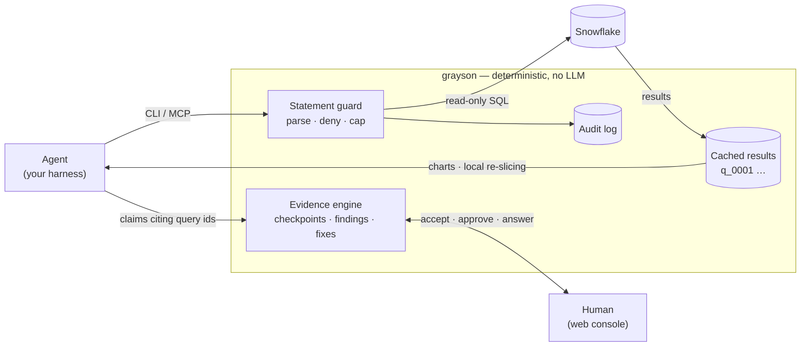
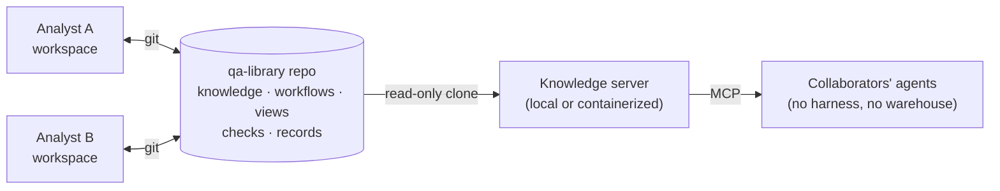

<p align="center">
  <picture>
    <source media="(prefers-color-scheme: dark)" srcset="docs/img/wordmark-dark.svg">
    
  </picture>
</p>

<p align="center"><b>Guarded SQL rails for agentic data investigation.</b></p>

<p align="center">Read-only by parser · claims gated on executed queries · humans at every boundary.</p>

<p align="center">
  <a href="pyproject.toml"></a>
  <a href="LICENSE"></a>
  <a href="#what-grayson-guarantees"></a>
</p>

---

Agents are now really good at data QA, troubleshooting and remediation. But the investigation process in a typical enterprise warehouse is messy. Sometimes it's open-ended, and in chaotic schemas and disjointed orgs, each agent has to overcome the a mountain of patchy context to do real work. grayson resolves that: bring your own agent (BYOA) — in Cursor, Claude Code, VSCopilot, Codex,
or any other harness, and grayson gives it rails to run on, and you, the confidence to automate analytic workflows. Currently, Snowflake-first. Guarded read-only access. Sessions that cannot claim
work without evidence. A human console at every critical semantic judgment call. A
git-shared team library so every investigation makes the next one smarter. Documentation of every pipeline fix persists beyond your agents context window. 

Holy Cartesian Product Batman! 

grayson itself never calls an LLM. Every guarantee is enforced by code, not by
prompts.

<picture>
  <source media="(prefers-color-scheme: dark)" srcset="docs/img/session_dark.png">
  
</picture>

*A bug-hunter session, live: the agent's charts (each traceable to an executed
query id), an intervention awaiting a human answer, and evidence-gated
checkpoints. The console refreshes itself while agents work.*

## What grayson guarantees

| Rail | Mechanism |
|---|---|
| Read-only warehouse access | Every statement is parsed and default-denied: only `SELECT`/`SHOW`/`DESCRIBE`/`EXPLAIN` survive. Fixes are proposals a human applies — agents never hold write rights. |
| Evidence or it didn't happen | Checkpoints, findings, and fix verifications close only by citing query ids that actually executed and touched the tables under investigation. |
| Humans at the boundaries | Fix application, gate overrides, budget raises, and fact confirmation are user actions; the agent-facing config surface is read-only. |
| Cost control | Auto-`LIMIT`, per-statement timeout, and per-session query budget, bundled as guard profiles. |
| Audit | Every statement — accepted or rejected — is recorded; `grayson audit reconcile` diffs warehouse history against the trail to catch what ran around it. |

The threat model, the adversarial review history, and the honest limits of
each layer: [docs/SECURITY.md](docs/SECURITY.md) · [docs/SPEC.md](docs/SPEC.md).

## How it works



The agent works the loop: **start** a session for a workflow over target
tables (arriving pre-briefed with team knowledge and failing external checks
as leads) → **analyze** with guarded queries, charting as it goes → **ask**
a human when judgment is needed → **findings, fixes, verification**, each
gated on evidence and human approval → **compound**: what was learned outlives
the session.

That last step is the point. Sessions stay local; their vetted output — facts,
accepted findings, verified fixes, forked workflows — travels through an
ordinary git repo, and even collaborators who never run the harness can serve
it to their agents read-only:



## Getting started

Requires [uv](https://docs.astral.sh/uv/) and, for real warehouses only, the
[Snowflake CLI](https://docs.snowflake.com/en/developer-guide/snowflake-cli)
with a named connection — grayson delegates all auth to `snow` and never
handles credentials.

```bash
uv tool install git+https://github.com/Kcarreras/grayson
cd your-data-repo
grayson setup                     # guided: workspace → connection → user id →
                                  #   team library → harness → guard permissions
```

Prefer flags? Every step is its own command — `grayson init .`, `doctor`,
`user set <id>`, `library link <url>`, `harness init claude-code|cursor|codex|copilot`.

No Snowflake yet? The sandbox is a full demo on a local mock warehouse,
seeded with planted, workflow-matched bugs and a scoring answer key:

```bash
grayson sandbox init my-demo && cd my-demo
grayson harness init claude-code
# then ask your agent to run a workflow against the sandbox tables
```

## Deployment modes

Two independent choices — the surface (full harness vs knowledge-only) and
the transport (local stdio vs served HTTP). All four combinations work; the
default needs no server and no daemon.

| Mode | Snowflake credentials | For |
|---|---|---|
| Full, local (default) | The analyst's own | Running investigations end to end |
| Knowledge-only, local | None | Briefing a collaborator's agent from the team library |
| Knowledge-only, served | None | A whole team's agents, via one containerized read-only endpoint |
| Full, served | Held by a service account, away from agents | Environments where warehouse credentials must not exist beside agents |

Recipes, the Docker image, and the trust model of each:
[docs/DEPLOYMENT.md](docs/DEPLOYMENT.md).

## Going deeper

| Doc | What's in it |
|---|---|
| [docs/SESSIONS.md](docs/SESSIONS.md) | Running sessions: harness setup, the loop in detail, charts, guard profiles and settings |
| [docs/WORKFLOWS.md](docs/WORKFLOWS.md) | Workflow templates: the core six, forking and ownership, lint, the Workflows tab |
| [docs/LIBRARY.md](docs/LIBRARY.md) | The team library: knowledge provenance, user ids, records that compound, knowledge-only access |
| [docs/CHECKS.md](docs/CHECKS.md) | Feeding external checks (dbt, Airflow, …) in as pre-vetted leads |
| [docs/DEPLOYMENT.md](docs/DEPLOYMENT.md) | Deployment recipes: solo, knowledge appliance, credential-isolated server |
| [docs/SECURITY.md](docs/SECURITY.md) | Threat model, adversarial review log, bypass and containment |
| [docs/SPEC.md](docs/SPEC.md) | The full design spec |

## Development

```bash
uv run pytest        # test suite (unit, CLI, MCP, UI, adversarial guard cases)
uv run ruff check .  # lint
uv run ruff format . # format
```

## Why "grayson"?

Data quality is made of gray areas — is the NULL spike a bug or a backfill?
grayson settles them the only way that counts: a query that actually ran,
cited by id. Gray areas in, evidence out.

```
 __ _ _ _ __ _ _  _ ___ ___ _ _
/ _` | '_/ _` | || (_-</ _ \ ' \
\__, |_| \__,_|\_, /__/\___/_||_|
|___/          |__/
```

## License

[MIT](LICENSE)
