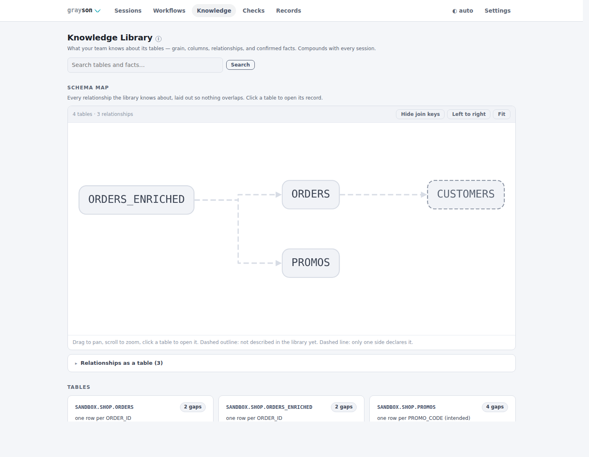

# The team library

Knowledge compounds through an ordinary git repo — no server. Table facts
with provenance, QA views, workflow templates, external check results,
report profiles, and published records are all plain, merge-friendly files.
Solo mode keeps them in the workspace; team mode shares them through the
repo.

## Linking a library

```bash
# one-time, per team: create an EMPTY repo on your git host, then
grayson library link git@github.com:your-org/qa-library.git --auto-push
```

This clones the repo, scaffolds the structure (`knowledge/`, `views/`,
`workflows/`, `checks/`, `records/`, `reports/`), pushes the first commit,
and points the workspace at the clone. Collaborators run the same command.

- `--auto-push` commits and pushes every library write; otherwise
  `grayson library push` batches.
- Concurrent pushes are handled: when a teammate pushed first, the rejected
  push rebases the library commit onto theirs and retries once. On a genuine
  conflict (both edited the same lines) the write stays committed locally and
  the sync result says to `grayson library pull`, resolve, and `push` —
  nothing is lost either way. Agent surfaces should check `library_sync.ok`.
- `grayson library status|pull` keep the clone fresh.
- `grayson library extract` splits a solo workspace's assets into a new repo.
- Git auth stays inside git — grayson never handles those credentials.

## Knowledge, with provenance

Facts about tables carry a status — `proposed` / `data_inferred` /
`user_confirmed` — and agents can never mark a fact user-confirmed:
confirmation is a human action (a Confirm button on the console's table page,
or `grayson knowledge confirm`). Structured base descriptors (grain, columns,
relationships, freshness, owners) live beside free-form facts; each table's
completeness report shows what is still undescribed.

The table page is editable where a human is the authority: write facts
directly (recorded user-confirmed — you *are* the confirmation), fill in
column descriptions and the grain/freshness/owners descriptor, and answer
open questions inline — the question retires and the answer becomes a
confirmed fact. Agents get the same lightweight path for questions a user
simply answers in chat: `grayson knowledge answer` (MCP: `knowledge_answer`)
records the relayed answer as a `proposed` fact and retires the question, no
session required — confirmation still waits for the human.

<picture>
  <source media="(prefers-color-scheme: dark)" srcset="img/knowledge_dark.png">
  
</picture>

The console's Knowledge tab adds a relationship canvas of the whole library
(Cytoscape + ELK, vendored); each table page shows its completeness report,
facts, and covering external checks.

## Format stability

The library's file formats are a public interface with a compatibility
contract — the code adapts to the files, never the reverse:

- **Useful with zero grayson.** Markdown + YAML frontmatter and small JSON:
  readable from the raw repo by a human or any agent. No change trades this
  away.
- **Additive-only within a format version.** Fields never change meaning or
  disappear; a rename writes both names and reads either for a window.
- **Unknown fields round-trip.** An older grayson preserves what a newer one
  (or a hand edit) wrote — a rewrite never strips fields it doesn't know.
- **Docs are stamped** (`format: N`; unstamped means format 1). A newer doc
  loads best-effort but is **refused for rewrite**, with an upgrade message —
  never silent loss. Published records carry the same stamp; a record from a
  newer grayson serves best-effort (fields are additive) and `doctor` flags
  it for upgrade.
- **Breaking changes ship only with `grayson library migrate`:** clean git
  tree required, one labeled commit, run deliberately by a human. Never
  implicit on read; git history is the rollback.

```bash
grayson library doctor    # read-only health pass; non-zero exit on errors
grayson library migrate   # idempotent; refuses on a dirty tree
```

Hand edits and merges are first-class, so drift is normal — `doctor` finds
it on demand: the doc that no longer parses, the fact id a merge duplicated,
the newer-format doc this version can read but not rewrite.

## Attribution: user ids

```bash
grayson user set kcg     # once, stored in ~/.grayson/config.toml
```

Every fact carries the id (`author`), and every library commit carries a
`Grayson-User:` trailer (plus `Grayson-Via: mcp-agent` for agent-surface
writes) — history stays attributable even from shared machines.
`GRAYSON_USER_ID` overrides per process.

## Records: sessions stay local, their output travels

Raw session state (query cache, live progress, interventions) never leaves
the workspace. At the human-approved moments — a finding accepted, a fix
verification recorded — the distilled record publishes into `records/` as
small, author-stamped JSON. Rejected findings never publish; accepting a
superseding finding republishes the superseded one so the library copy stops
reading as current.

Every published record carries the queries it cites — statement, executed
form, timestamp, outcome, tables — as `evidence_queries`, because a query id
is a per-session counter (`q_0002` means nothing outside its session) and the
SQL lives only in local session state. The record page shows them one fold
away, links them to the query page while the session is local, and qualifies
every id with its session. Results stay local; the statement and its stats
are what a reviewer needs.

From any linked workspace, `grayson records search` answers "how did anyone
on the team diagnose and fix something like this" — collaborators' records
merge into every search, badge `team` in the console, and open from the
published copy when the session isn't local.

## Reports: profiles in, whole investigations out

Report facts render deterministically from the session record and are not
configurable. *Presentation* is a **report profile** — a small YAML in
`reports/` (scaffolded with a commented `default.yaml`): section order and
inclusion, `engineering` vs `stakeholder` audience, header/footer. Pick one
with `grayson session report --profile <name>`.

When a session closes, its full report publishes into `records/<sid>/`
(`report.md` + searchable `report.json`), so `records search` returns whole
investigations — the agent's cited narrative included — not just their
findings.

## Knowledge without the harness

A collaborator who never runs sessions can serve the library to their agent
read-only — no workspace, no Snowflake, no write tools registered:

```bash
grayson mcp serve --knowledge-only --library git@github.com:your-org/qa-library.git
```

Serves `knowledge_*`, `workflow_*`, `views_list`, `checks_*`, `records_*`,
and `library_info` over stdio. The same surface runs containerized for a
whole team — see the knowledge-appliance recipe in
[DEPLOYMENT.md](DEPLOYMENT.md).
