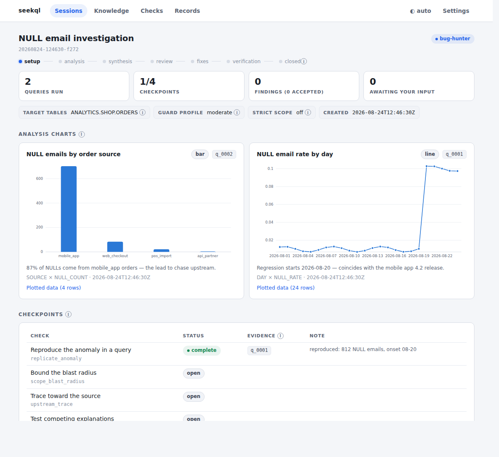
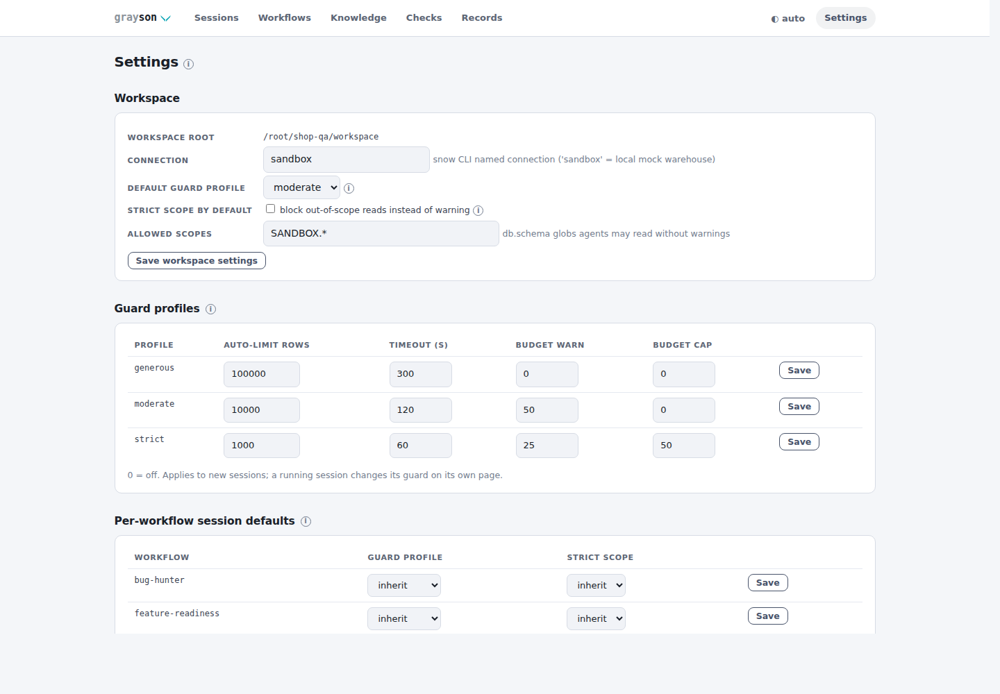

# Running sessions

How an investigation actually runs: teaching your harness the protocol, the
session loop in detail, charts, and the guard settings that bound it all.
For what the rails guarantee (and their limits), see [SPEC.md](SPEC.md) and
[SECURITY.md](SECURITY.md).

<picture>
  <source media="(prefers-color-scheme: dark)" srcset="img/session_dark.png">
  
</picture>

*A bug-hunter session, live: the agent's charts (each traceable to an executed
query id), an intervention awaiting a human answer, and evidence-gated
checkpoints. The page refreshes itself while agents work.*

## Teaching your harness the protocol

```bash
grayson harness init cursor        # or claude-code | codex
```

This writes the protocol file for your harness (a Cursor rule, a `CLAUDE.md`
section, or an `AGENTS.md` section) — and offers to also write harness
**guard permissions**: deny rules so the agent calling `snow` directly, or
reading `.grayson/` state, hits a permission prompt instead of silently
working around the guard. Consent-based and reversible:
`grayson harness guard status|apply|remove`.

Harnesses that prefer typed tools use the MCP server instead — `grayson mcp
serve` (stdio) mirrors the CLI one-to-one; the served variants are in
[DEPLOYMENT.md](DEPLOYMENT.md). `grayson status` tells you where you are and
what needs attention; `latest` works anywhere a session id is expected.

## A typical session (driven by the agent)

```bash
grayson session start --workflow bug-hunter --table ANALYTICS.WEB.PAGE_EVENTS \
  --input anomaly_description="revenue rows doubled since Tuesday"
grayson query run <sid> --sql "SELECT ..." --label "why"  # guarded; cached as q_0001…
grayson cache query <sid> -q "SELECT ... FROM q_0001"     # re-slice locally, no warehouse trip
grayson chart add <sid> -a q_0001 -k line -x day -y null_rate --title "..."
grayson checkpoint complete <sid> replicate_anomaly -e q_0003
grayson finding add <sid> --json '{...}'                  # schema + evidence validated
grayson ui serve                                          # the human console
grayson session report <sid> --out report.md              # shareable report
```

Each workflow defines **setup inputs** — the questions a human answers before
analysis starts. The agent collects them in chat and records them with
`--input key="answer"` (MCP: the `inputs` dict), so the session itself
documents why it was started; they appear in the console and the report. A
human driving a session by hand can instead pass `--interactive` to be walked
through them as prompts (terminal only — agents never use it).

Session start snapshots table metadata, loads the relevant knowledge, checks
QA-view coverage, and surfaces failing external checks on the target tables as
pre-vetted leads ([CHECKS.md](CHECKS.md)). Checkpoints close only by citing
executed queries that touched the tables under investigation. When a judgment
call needs a human — labeling samples, confirming semantics — the agent files
an intervention and waits; the answer arrives from the console. Findings
validate against the workflow's schema; the human accepts or rejects each one,
approves proposed fixes, and the agent proves an applied fix with a
deterministic before/after comparison of re-run queries.

## Analysis charts

Agents chart cached query results as they work — `grayson chart add` (MCP:
`chart_add`) validates the column mapping against the artifact's real shape and
the console renders the chart on its live refresh. Every chart carries the
`q_XXXX` id of the query behind it and a "plotted data" fold with the exact
rows drawn.

The same chart comes back as a Unicode rendering the agent pastes into its chat
reply, so the shape shows up in the conversation too:

```
NULL email rate by day  [line · q_0007]
null_rate ▁▁▁▁▁▁▁▁▁▁▁▁▁▁▁▁▁▁▁█████  min 0.007 · max 0.1027 · last 0.0973
       x: 08-01 → 08-24

NULL emails by order source  [bar · q_0008]
      mobile_app │████████████████████████████████████ 702
    web_checkout │████▍ 84
      pos_import │█▎ 22
     api_partner │▎ 4
```

Kinds: `bar`, `line`, `scatter`; up to three series (the palette is validated
colorblind-safe at three slots in both console themes — more dimensions means
more charts, not more colors). `grayson chart render --out chart.svg` exports
standalone SVGs.

## Settings and guard profiles

Workspace configuration lives in `grayson.toml` — committed, reviewable,
diffable. Two surfaces change it, both human: `grayson config` and the
console's Settings page. The MCP surface exposes configuration **read-only**
by design — an agent that can loosen its own guards has no guards.

```bash
grayson config show
grayson config set defaults.guard_profile=strict scopes.strict=true
grayson config profile overnight --auto-limit 0 --budget-cap 500
```

Guard profiles bundle three independent cost controls — auto-`LIMIT`,
per-statement timeout, per-session query budget — selected per session,
editable per workspace. Scope is per session: out-of-scope reads warn by
default; `strict` mode blocks them.

<picture>
  <source media="(prefers-color-scheme: dark)" srcset="img/settings_dark.png">
  
</picture>

Light/dark theme is per-browser (the toggle in the console's top bar), not a
workspace setting.

## Auditing what ran

Every statement — accepted or rejected — lands in the session's audit log with
hash, worker, verdict, and stats. `grayson audit reconcile` (human-only; no MCP
twin) diffs the warehouse's own query history against that trail and flags
statements that ran around grayson; `--ingest` records the verdict as an
external check. Details: [SECURITY.md](SECURITY.md).
