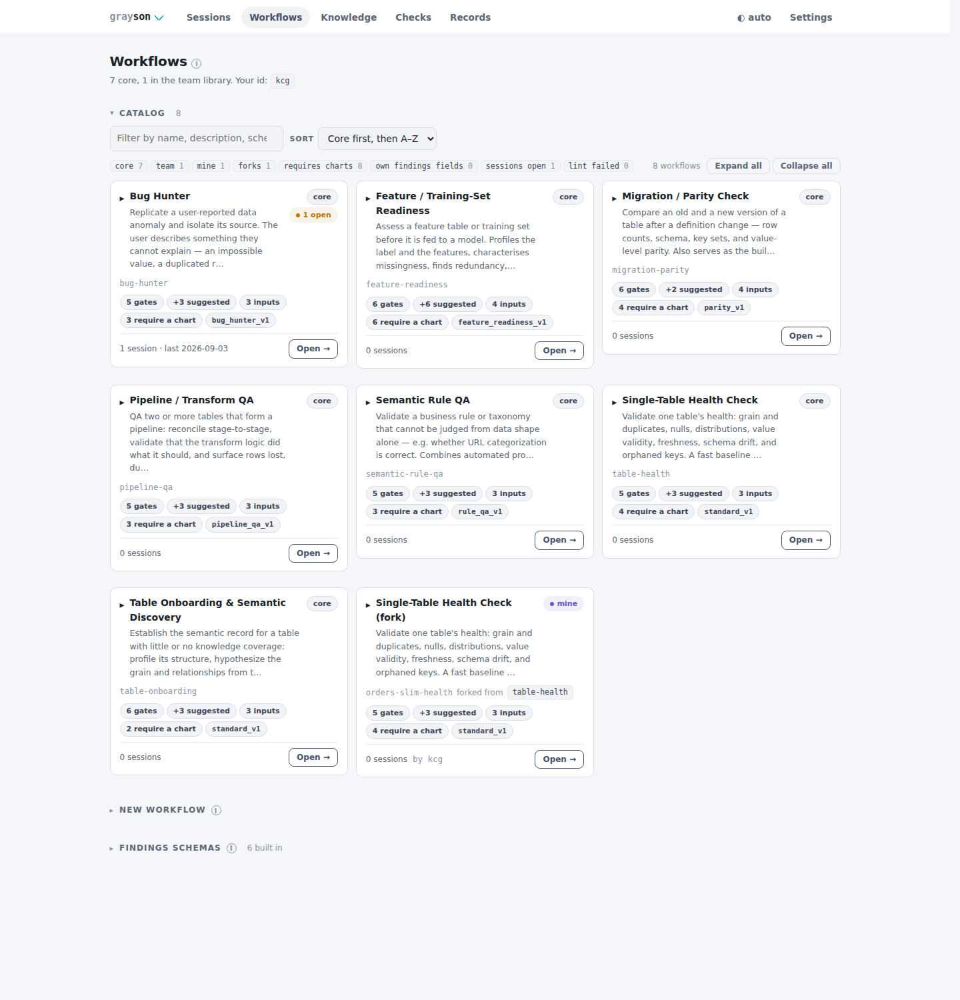
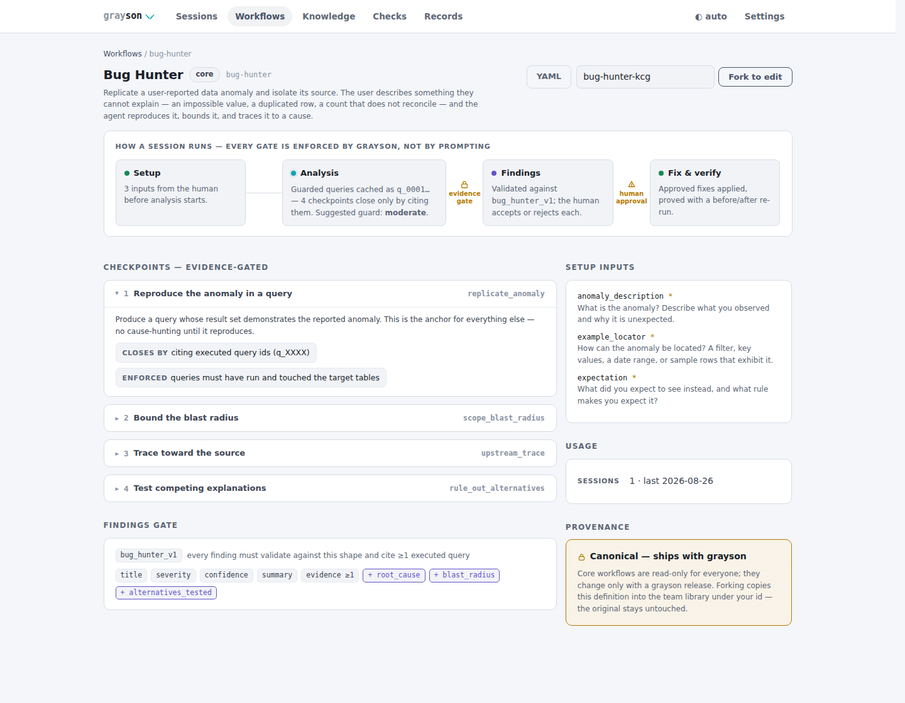

# Workflows

A workflow template defines the shape of an investigation: the setup inputs a
human provides, the evidence-gated checkpoints a session must clear, and the
findings schema every claim validates against. Templates are YAML data — small
files an analyst can read, fork, and share.

## Required, suggested, waived

A workflow has to be complete without being universal, and those pull against
each other: a check that is mandatory everywhere gets closed hollow where it
does not apply, which is precisely the evidence-laundering the gate exists to
prevent. So checkpoints come in two kinds, with an escape for the third case.

- **`required_checks`** gate. Keep them to the handful without which the
  investigation is meaningless — four to six is the shape of the core set.
  `depends_on` expresses the rare genuine ordering (bug-hunter will not let you
  hunt a cause before the anomaly reproduces). `uses_inputs` names which of the
  user's setup answers a check works from — it tells the agent what the check is
  testing, and lint uses it to catch a required input no checkpoint ever reads.
- **`suggested_checks`** carry breadth and gate nothing. They are surfaced at
  session start and in the console; an agent does the ones that fit the tables
  in front of it and closes those like any other checkpoint. This is how a
  workflow names thirty fundamentals without demanding all thirty on a
  five-column lookup table.
- **Waiving** handles the last case: a *required* check that genuinely does not
  apply here. The agent asks (an intervention saying why); a human waives it
  with a reason. Waived satisfies the gate and never renders as complete.

## The core templates

Seven ship built-in:

| Workflow | Purpose |
|---|---|
| `bug-hunter` | Replicate a reported anomaly and isolate its source |
| `pipeline-qa` | Validate a transform/pipeline stage end to end |
| `table-health` | Single-table health: grain, nulls, distributions, domain validity, freshness |
| `semantic-rule-qa` | Test stated business rules against the data |
| `migration-parity` | Old-vs-new parity: schemas, counts, keys, values, null semantics |
| `table-onboarding` | Build the base descriptor for an undocumented table |
| `feature-readiness` | Assess a feature table / training set before it feeds a model |

`feature-readiness` is the ML-prep workflow, and it is deliberately **not** a
generic "EDA" workflow. Descriptive profiling of one table already lives in
`table-health` and `table-onboarding`; a third workflow doing the same
statistics differently would be a junk drawer. What was actually missing is the
*decision*: is this set safe to train on? So its checkpoints are the things that
sink a model — population and grain, label distribution and base rate,
missingness **mechanism** rather than rate, redundancy, and the one nobody runs
by hand: leakage and point-in-time correctness. Its schema requires a
`leakage_assessment` that says what was tested, because "not assessed" is how
that check gets skipped.

`bug-hunter` opens by checking the *expectation* itself — a large share of
reported anomalies are misunderstandings of the grain or of a deliberate rule,
and finding that out costs one query here and a day of lineage walking later.
Its findings schema takes a `resolution`: `root_caused`, or `inconclusive` with
what is still open. An investigation that reproduces and bounds an anomaly
without isolating it is a real result, and a schema that accepts only a
confident answer will be given one.

`migration-parity` doubles as the verification stage for every other workflow.

Core templates are **canonical**: a library file cannot shadow a core name (a
collision is rejected and reported, never merged), so core behavior changes
only with a grayson release. Customization forks under a new name.

## Findings schemas and severity

Each workflow validates its claims against a closed-ended schema, and the schema
is the only enforceable quality lever on the open-ended end of the range. Five
ship: `standard_v1`, `bug_hunter_v1`, `parity_v1`, `pipeline_qa_v1`,
`rule_qa_v1`, `feature_readiness_v1`. Two use a discriminator to keep their
demands honest — `bug_hunter_v1` asks for a `resolution` (`root_caused` or
`inconclusive`, the latter needing `remaining_hypotheses`), and `rule_qa_v1` asks
for a `finding_kind`, because an accuracy estimate must carry its sample size and
sampling frame while an unreachable-category defect has no sample behind it at
all.

Severity has a published scale (`grayson finding rubric`, MCP `finding_rubric`),
because without a shared one every finding drifts to "high" and a queue where
everything is high has no priority in it. grayson does not judge whether a
severity is *right* — that is what accepting and rejecting are for. It makes the
top two rungs cost the specificity a real severe finding already has:

- `confidence: high` requires a `reproduction`. If nobody else can go and see it,
  it is not high confidence.
- `severity: critical` or `high` requires `affected_objects`. A severe finding
  nobody can locate cannot be acted on.

## Team workflows: fork, edit, share

The library's `workflows/` directory extends the catalog with the team's own
templates, shared by git like everything else in the library
([LIBRARY.md](LIBRARY.md)). Each carries provenance in the YAML itself:
`created_by` (the author's `grayson user` id) and, for forks, `forked_from`
lineage.

```bash
grayson workflow new orders-slim-health --fork table-health
```

Editing is ownership-aware, enforced server-side in the console: workflows
you created edit in place; a collaborator's workflow — or a core template —
forks a copy under your id instead, so nothing shared breaks under someone
else's edit. A legacy file with no recorded author is editable by anyone, and
the first save stamps the editor's id.

## Lint: broken workflows are loud

```bash
grayson workflow lint
```

Errors (non-zero exit, CI-friendly for the qa-library repo): YAML that does
not parse or validate, core-name shadowing, duplicate workflow names,
duplicate checkpoint keys, unknown findings schemas. Warnings: missing
descriptions (agents pick workflows by description), workflows with no
checkpoints, file/name mismatches, a `depends_on` naming a check the workflow
does not define, a `uses_inputs` naming an input it does not have, and a
required setup input no checkpoint works from — a question asked of the user and
then ignored. The same semantic rules run over the **core** templates in the
test suite: they are canonical and non-editable, so their quality is grayson's
to keep rather than a reviewer's to notice. A file that fails to load is reported
everywhere workflows are listed — CLI, MCP (`workflow_list.library_problems`),
and red-badged in the console — never silently skipped: **loadable means
runnable**.

## The Workflows tab

<picture>
  <source media="(prefers-color-scheme: dark)" srcset="img/workflows_dark.png">
  
</picture>

The console's Workflows tab makes the catalog browsable: a gallery of core and
team workflows (lint failures shown red, in place), and a create-or-fork card.
Each workflow's page draws the session flow stage by stage — evidence gates
and human-approval points marked — with every checkpoint, setup input, and
findings-schema field unpacked, plus usage and provenance.
`/workflows/{name}/yaml` exports any definition for sharing.

<picture>
  <source media="(prefers-color-scheme: dark)" srcset="img/workflow_detail_dark.png">
  
</picture>
